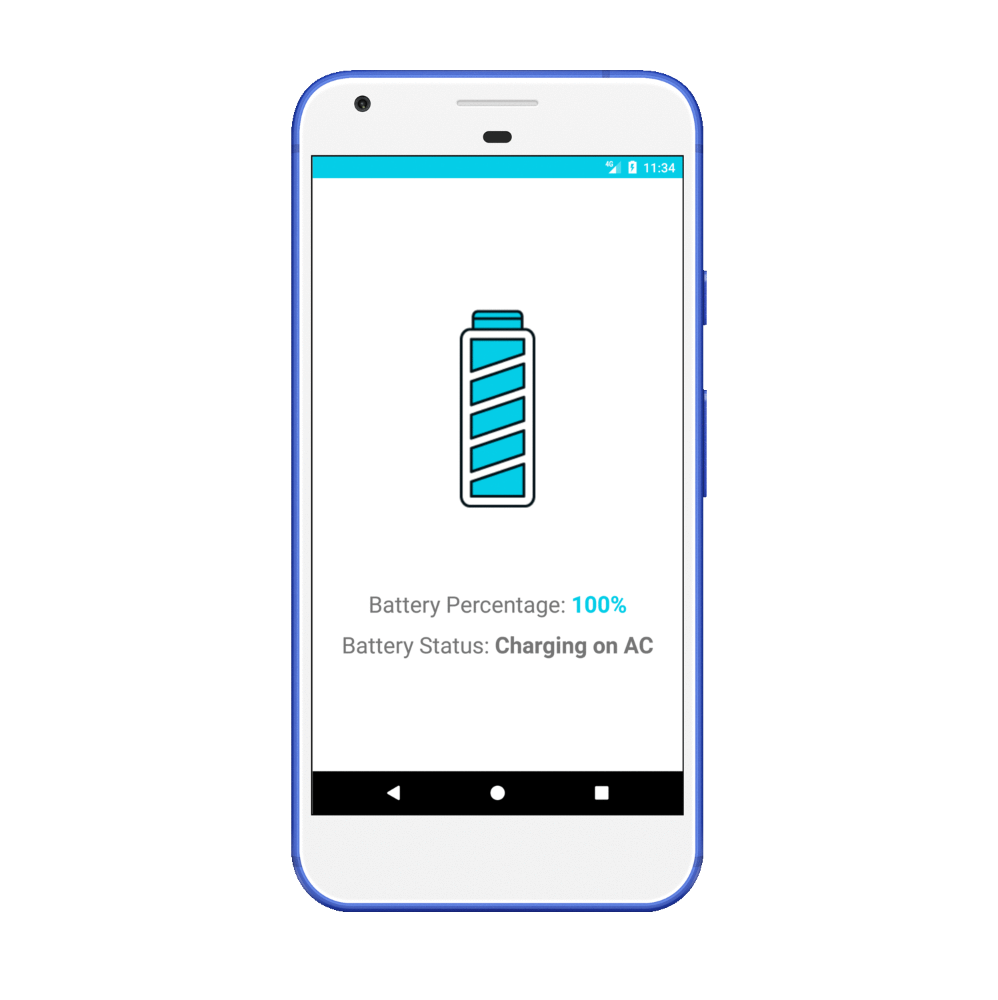

# battery-info-rn

A simple application that displays battery percentage and status on Android.

This application is developed as a part of the tutorial ["Getting Started with developing native Android modules in React Native"](https://www.sitepoint.com/) written by [Rohan Agarwal](https://rohanx96.in/)

## Running the application

Clone the repository.\
At root of your project, run the following commands:

1. npm install
2. react-native start
3. react-native run-android

*(NPM and React-Native CLI should be installed and Android SDK and environment should be setup already. Follow instructions here : [React Native: Getting Started](https://facebook.github.io/react-native/docs/getting-started.html)*
